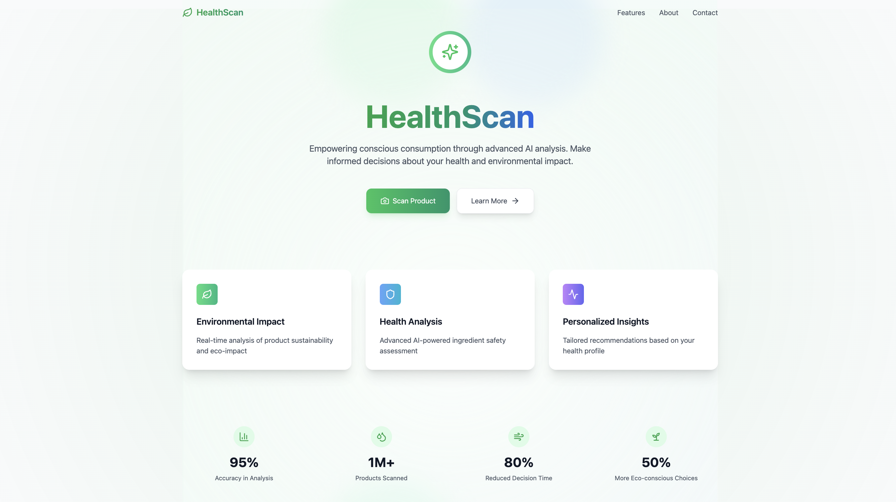

# HealthScan - AI-Powered Product Analysis - LINK - (https://github.com/lucky0612/healthscan)

HealthScan is a modern web application that empowers consumers to make informed decisions about products by providing real-time analysis of health impacts and environmental considerations. Using advanced AI and image processing, it scans product labels and provides detailed insights about ingredients, potential allergens, and environmental sustainability.
## Images

## 🌟 Features

### Core Functionality
- 📸 Real-time product label scanning and OCR
- 🤖 AI-powered ingredient analysis using Google's Gemini API
- 🏥 Comprehensive health impact assessment
- 🌱 Environmental sustainability evaluation
- ⚠️ Allergen detection and alerts
- 📊 Detailed ingredient breakdown

### Technical Features
- ⚡ High-performance React application
- 🎨 Beautiful, responsive UI with Tailwind CSS
- ✨ Smooth animations with Framer Motion
- 📱 Mobile-first design approach
- 🔄 Real-time processing status updates
- 🎯 Accurate OCR using Tesseract.js

## 🚀 Getting Started

### Prerequisites
- Node.js (v16.0.0 or higher)
- npm (v7.0.0 or higher)
- A Google Gemini API key

### Installation

1. Clone the repository:
   ```bash
   git clone https://github.com/yourusername/healthscan.git
   cd healthscan
   ```

2. Install dependencies:
   ```bash
   npm install
   ```

3. Create a .env file in the root directory:
   ```env
   VITE_GEMINI_API_KEY=your_gemini_api_key_here
   ```

4. Start the development server:
   ```bash
   npm run dev
   ```

### Building for Production
```bash
npm run build
```

## 🏗️ Project Structure

```
healthscan/
├── src/
│   ├── components/
│   │   ├── layout/          # Layout components (Navigation, Footer)
│   │   ├── scanning/        # Scanning and processing components
│   │   ├── analysis/        # Analysis result components
│   │   ├── ui/             # Reusable UI components
│   │   └── home/           # Homepage components
│   ├── context/            # React context providers
│   ├── hooks/              # Custom React hooks
│   ├── services/           # API and processing services
│   ├── utils/              # Utility functions
│   └── styles/             # Global styles and Tailwind config
├── public/                 # Static assets
└── ...config files
```

## 🛠️ Technology Stack

### Core Technologies
- React 18
- Vite
- Tailwind CSS
- Framer Motion

### APIs and Libraries
- Google Gemini API for AI analysis
- Tesseract.js for OCR
- Axios for API requests
- Lucide React for icons
- Headless UI for accessible components

### Development Tools
- ESLint for code linting
- Prettier for code formatting
- PostCSS for CSS processing

## 🧪 Development

### Running Tests
```bash
npm test
```

### Linting
```bash
npm run lint
```

### Code Formatting
```bash
npm run format
```

## 📱 Features in Detail

### 1. Product Scanning
- Real-time image capture
- OCR processing with progress tracking
- Ingredient extraction and classification

### 2. Health Analysis
- Ingredient safety assessment
- Allergen identification
- Nutritional impact evaluation
- Personalized health recommendations

### 3. Environmental Impact
- Sustainability scoring
- Packaging assessment
- Environmental impact metrics
- Eco-friendly alternatives suggestions

### 4. User Interface
- Intuitive scanning interface
- Real-time progress indicators
- Interactive results dashboard
- Responsive design for all devices

## 🤝 Contributing

1. Fork the repository
2. Create your feature branch (`git checkout -b feature/AmazingFeature`)
3. Commit your changes (`git commit -m 'Add some AmazingFeature'`)
4. Push to the branch (`git push origin feature/AmazingFeature`)
5. Open a Pull Request

### Commit Guidelines
We use conventional commits for clear communication:
- feat: New features
- fix: Bug fixes
- docs: Documentation changes
- style: Code style changes
- refactor: Code refactoring
- test: Test updates
- chore: Routine tasks and maintenance

## 📃 License

This project is licensed under the MIT License - see the [LICENSE](LICENSE) file for details.

## 🙏 Acknowledgements

- [Google Gemini](https://deepmind.google/technologies/gemini/) for AI capabilities
- [Tesseract.js](https://tesseract.projectnaptha.com/) for OCR functionality
- [Tailwind CSS](https://tailwindcss.com) for styling
- [Framer Motion](https://www.framer.com/motion/) for animations
- [Lucide Icons](https://lucide.dev) for beautiful icons

## 📞 Support

For support, please open an issue in the GitHub repository or contact the development team at support@healthscan-app.com.

## 🚀 Roadmap

- [ ] Multi-language support
- [ ] Barcode scanning integration
- [ ] Product comparison features
- [ ] Community reviews and ratings
- [ ] Browser extension development
- [ ] Mobile app development

---

Made with ❤️ by [Lakshya]
